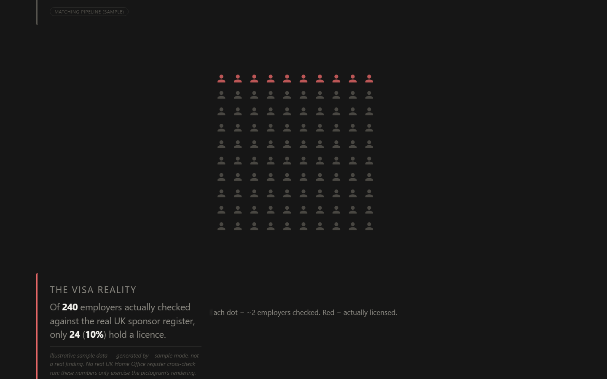
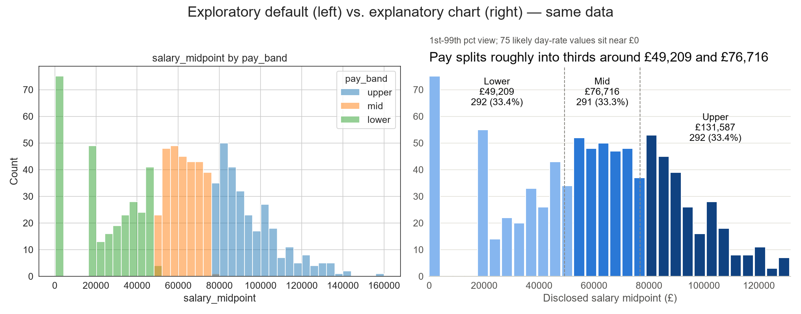
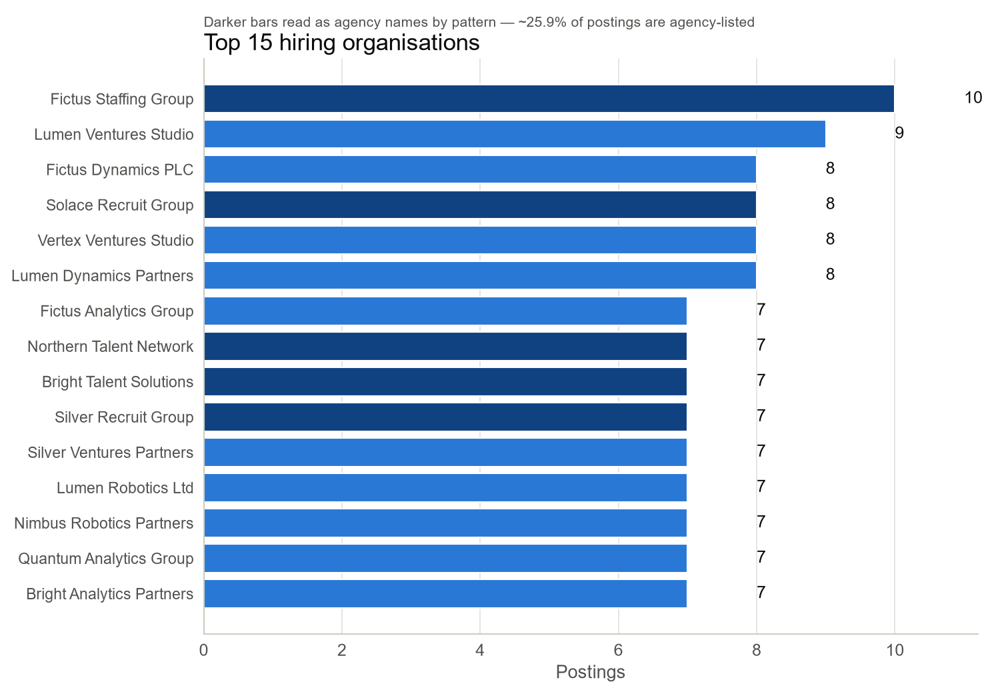
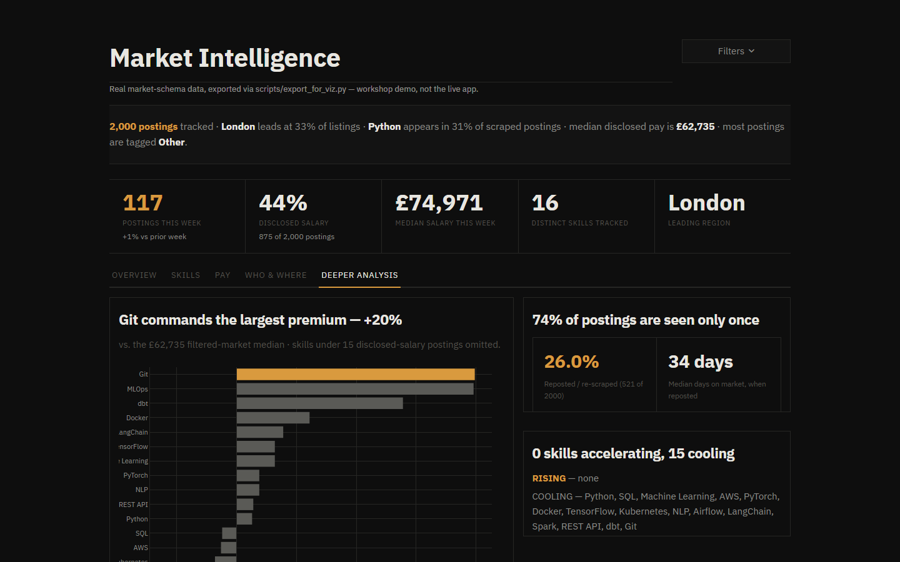
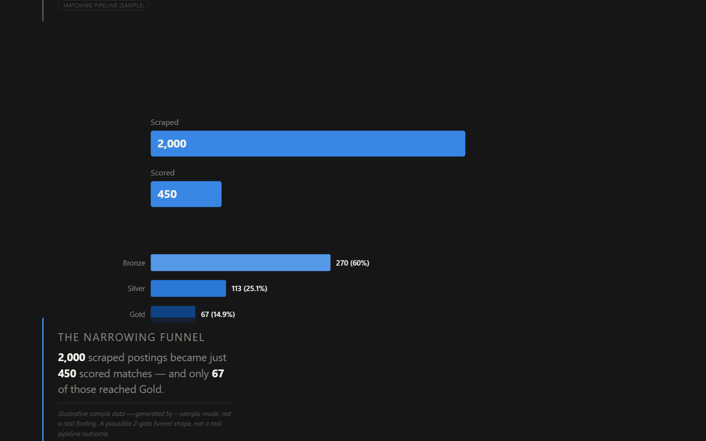

# Data Storytelling Workshop

A workshop artefact plus an applied project built on top of it: a two-day
UCL SODA course on Python data visualisation, and my own attempt at running
its techniques against a real, messy dataset instead of the course's clean
library examples.

<p align="center">
  
</p>
<p align="center">
  
</p>

*(Both screenshots above are running against the committed synthetic
sample — see [Honest limitations](#honest-limitations). Two more chart
screenshots are in [`docs/images/`](docs/images/), and the full chart set
is in [`docs/charts/`](docs/charts/).)*

## What the workshop was

**Python for Data Storytelling**, UCL SODA (Social Data Institute),
Edinburgh, 16–17 July 2026. Funded by UKRI under the Data Storytelling for
Digital Research Infrastructure (DRI) project, convened by Dr. Igor Tkalec.
Day 1 was explanatory-visualisation theory plus Plotly/Bokeh/Altair; Day 2
was Streamlit dashboards plus a machine-learning-as-story-angle session
(decision trees, K-means). Full write-up, the theory citations, and an
honest technique-by-technique comparison against what I actually built are
in [`workshop/NOTES.md`](workshop/NOTES.md) — that file is the substantive
record of the two days, not this README.

## What I built

Two deliverables from the same UK AI/ML/DS job-market dataset (a
market-intelligence agent's Postgres export — see
[`application/viz/README.md`](application/viz/README.md) for the real-data
caveats this project is built around, honestly, rather than around):

- **A chart survey + Streamlit dashboard** (`application/viz/`) — the same
  four "objectives" the workshop taught (trend, comparison, relationship,
  proportion) across matplotlib/seaborn, Plotly, Altair, and Bokeh, plus a
  dashboard that went through several visual redesigns before landing on
  the dark/greyscale/amber register shown above.
- **A scrollytelling story** (`application/viz/story/`) — a Tampa Bay
  Times "Failure Factories"-style single-page scroll narrative, one
  persistent D3 chart that morphs between states, built from a second,
  related dataset. See [`application/viz/story/README.md`](application/viz/story/README.md)
  for the full narrative sourcing and its own honest cut-corners list.

| | |
|---|---|
|  |  |
|  |  |

Interactive Plotly/Altair/Bokeh HTML exports (skill trends, salary by
experience, skill co-occurrence, work-model mix, top locations, weekly
posting volume) are in [`docs/charts/`](docs/charts/) — download and open
them locally; GitHub doesn't render arbitrary HTML inline.

## The design system, and why

The dashboard is deliberately dark, greyscale, with exactly one amber
accent (`#d99a3e`) reserved for the single most important number per view.
IBM Plex Sans throughout, including inside every embedded Plotly figure's
own `layout.font` (not just the Streamlit chrome around it). No rounded
corners, no box-shadows, no gradients, no emoji, no `st.metric`.

This isn't a style preference floated free of the workshop's own theory —
it's what "explanatory over exploratory" (Echeverria et al., 2018;
Dzuranin, n.d. — see `workshop/NOTES.md`) means once you push it past a
single chart and into a whole dashboard. Every rounded corner, gradient,
or decorative color is a pixel doing no work — it competes with the one
thing Dzuranin's explanatory-visualisation process says a finished chart
should be doing: telling the reader the finding, not decorating around it.
One accent color used exactly once per view is the same "highlight-one-
bar" technique from the workshop's own Plotly examples (grey-out
everything except the point the story is about), just applied at the
scale of an entire dashboard instead of one chart. Removing `st.metric`
wasn't a style choice at all — it was a real bug fix (`st.metric`'s
fixed-width CSS silently truncates compound values; see
`application/viz/README.md`) that happened to also produce a cleaner KPI
block once fixed.

## Running it — one command, no database

Every chart script and the dashboard can run against a committed synthetic
sample with zero setup:

```bash
cd application
pip install -r requirements.txt

# charts -> viz/output/*.png / *.html
python viz/01_matplotlib_seaborn.py --sample
python viz/02_plotly.py --sample
python viz/03_altair.py --sample
python viz/04_bokeh.py --sample

# dashboard -> http://localhost:8501
USE_SAMPLE=1 streamlit run viz/dashboard.py

# story -> regenerate its data, then serve it
python viz/story/build_story_data.py --sample
cd viz/story && python -m http.server   # http://localhost:8000
```

`--sample` and `USE_SAMPLE=1` do the same thing — the flag for the
standalone chart scripts, the env var for `streamlit run` (which can't
cleanly receive a custom CLI flag). Both point every loader at
`application/data/sample/` (~2,000 synthetic rows, generated by
`application/scripts/generate_sample_data.py`, obviously-fake company
names) instead of a real Postgres export.

To run against real data instead, see the "Getting the data" section in
[`application/README.md`](application/README.md) — you'll need your own
Postgres connection string; never commit one.

```bash
pytest tests/       # from inside application/ — 16 tests, all offline
ruff check .         # from inside application/
```

Both run in CI on every push (`.github/workflows/ci.yml`).

## Honest limitations

- **Every number on this page and in the linked screenshots comes from the
  committed synthetic sample, not a real scrape.** Company names are
  obviously fake, distributions are shaped to mirror the documented real-
  data caveats (see `application/viz/README.md`) rather than invented from
  nothing, but nothing here is a genuine market finding. The story page's
  `--sample` mode goes further and labels every step's source
  `"(sample)"` plus a `note` field saying so explicitly — see
  `application/viz/story/README.md`.
- **The story's funnel/visa/salary-vs-score steps need a second database**
  that this repo doesn't ship a sample for beyond the illustrative
  `--sample` numbers above — real regeneration needs
  `JOBFORGE_PIPELINE_DB_URL` pointed at a Postgres instance with that
  schema, which is outside this repo's scope.
- **A real bug was found and fixed while building the story page**: the
  persistent chart's `position: sticky` was silently broken by
  `overflow-x: hidden` on `html, body` (a well-known CSS gotcha — that
  property on any ancestor of a sticky element voids its stickiness
  against the true viewport). Scoped to `#app` instead; see the comment in
  `application/viz/story/story.css`.
- **`workshop/NOTES.md`'s technique mapping is honest about gaps**, not
  just wins — no decision tree/random forest is used anywhere in
  `application/` because there's no real target variable here to justify
  one, and no K-means clustering either (considered, didn't find a result
  worth standing behind with this data's actual coverage). See that file's
  closing section rather than assuming every workshop technique made it
  into the applied side.
