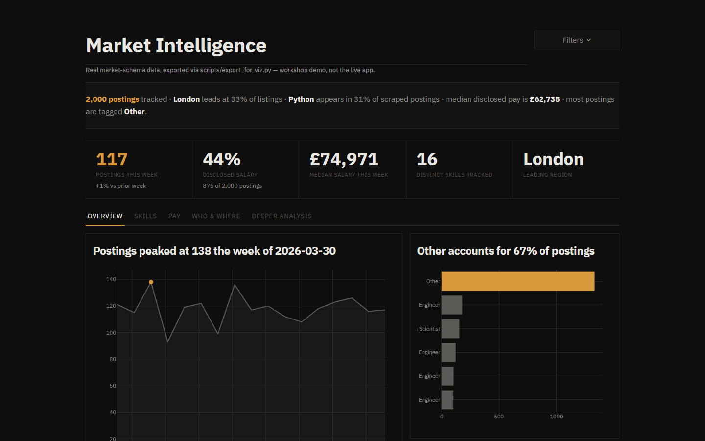

# Workshop Visualisations

<p align="center">
  
</p>

*(Running against the committed synthetic sample — see the root README's
"Honest limitations" section. More screenshots and the static chart exports
are in `../../docs/images/` and `../../docs/charts/`.)*

Phase 2 of the data-viz workshop experiment. All files here read from
`data/exports/` (produced by `python scripts/export_for_viz.py` against a
Railway Postgres project's `market` schema — a general market-intelligence
agent). `viz/shared.py` is fully standalone: `week_start`,
`classify_rising_cooling`, and `normalize_location` are implemented locally
(the latter backed by `data/uk_postcode_areas.json`) rather than imported
from any external pipeline.

## Setup

These need the workshop stack: `matplotlib`, `seaborn`, `plotly`, `altair`,
`bokeh`, `streamlit`, `pandas`, `pyarrow`. Run everything from the
`application/` directory so `viz/shared.py` and the `data/` paths resolve
correctly.

## Design system

`viz/shared.py` centralises the look shared by every chart and the
dashboard: a colorblind-validated categorical palette (fixed hue order —
never reassigned by rank), a single-hue sequential ramp used for the salary
pay-band ordinal encoding, a diverging blue/red pair for polarity (salary
premium vs. discount), and typography constants (`FONT_SIZE_*`) sized up
from each library's tiny defaults so labels stay legible once a chart is
embedded at half the dashboard's width. `humanize_label()` turns DB-style
snake_case values (`ai_engineer`, `mlops_engineer`) into readable axis
labels (`AI Engineer`, `MLOps Engineer`).

The dashboard went through several visual iterations before landing on its
current one — a dark, greyscale, financial-terminal register (`#0e0e0e`
ground, one amber `#d99a3e` accent applied only to the single most
important number per view, IBM Plex Sans loaded from Google Fonts and
applied globally including inside every Plotly figure's `layout.font`).
This is a deliberate departure from `viz/shared.py`'s light "Light Luxury"
palette, which the static `viz/01-04` chart scripts still correctly use —
this file doesn't touch those, the two palettes are intentionally separate.

Two real bugs were found and fixed in the process, not guessed at:
- **`st.metric` was silently truncating KPI values** ("829 (43.0%)" showed
  as "829 (43...."). `st.metric`'s internal value/label elements ship with
  fixed-width, single-line CSS (`overflow:hidden; text-overflow:ellipsis`)
  meant for short bare numbers — a compound string, at a larger font size,
  clipped. Fixed by dropping `st.metric` entirely in favour of hand-built
  HTML KPI blocks (`_kpi_html()`) with no such limit, and by keeping each
  block's headline number itself short (a percentage, not a "X of Y (Z%)"
  sentence — the longer figure moved to the small delta line underneath).
- **Charts were rendering with `st.plotly_chart`'s default `theme="streamlit"`**
  active on every call (never explicitly disabled). Confirmed via
  Streamlit's own source that this runs a client-side template/colorway
  substitution layer on top of the figure object before it reaches the
  DOM — the one unaccounted-for transformation between "the Python figure
  object is correct" (verified directly) and whatever actually renders.
  Every `st.plotly_chart` call now goes through a `_plot()` helper that
  passes `theme=None`, so the greyscale + single-accent palette set in
  Python is what actually renders, unmodified.

Every panel title states the finding computed from the current filter, not
the dimension being charted — "London absorbs 43% of listings", not "Top
region"; "Python appears in 74% of postings", not "Top skills." These are
computed live, not hardcoded, so they update correctly as filters change.
Streamlit's own chrome (main menu, footer, header/deploy button) is hidden
via CSS; panels are flat hairline-bordered blocks (no rounded corners, no
box-shadow, no white-card-on-grey look); there are no gradients anywhere.

## Running each chart

```bash
python viz/01_matplotlib_seaborn.py   # -> viz/output/01_*.png
python viz/02_plotly.py               # -> viz/output/02_*.html
python viz/03_altair.py               # -> viz/output/03_*.html
python viz/04_bokeh.py                # -> viz/output/04_*.html
streamlit run viz/dashboard.py        # interactive app, not a static file
```

All HTML outputs embed their JS libraries inline (`include_plotlyjs=True`,
Altair's `inline=True`, Bokeh's `mode="inline"`) rather than loading from a
CDN — they work with no internet in the workshop room.

## What each chart shows — and its takeaway

| File | Chart | Takeaway |
|---|---|---|
| `01_matplotlib_seaborn.py` | Salary by pay band (messy vs. polished, one figure) | Left panel is the exploratory default (unordered hue, redundant legend, 40-bin histogram); right panel is the explanatory version (ordinal lower→mid→upper ramp, tercile boundaries marked, counts direct-labelled, view clipped to 1st–99th percentile). Pay splits roughly into thirds around £37.5k and £70k. |
| `01_matplotlib_seaborn.py` | Role category distribution | "Other" dominates at ~66% — the role-tagging taxonomy doesn't yet cover most postings; AI Engineer and Data Scientist are the largest named categories. |
| `01_matplotlib_seaborn.py` | Top hiring organisations | ~26% of postings are agency-listed by name pattern (Harnham, Hays, Reed, Randstad...), not direct employers — darker bars flag these. |
| `02_plotly.py` | Weekly skill-mention trend, top 8 skills | Which skills are actually rising/falling week to week — Python and SQL dominate every week; hover any point for the exact count. |
| `02_plotly.py` | Salary by experience level | Whether seniority actually commands a pay premium in this data, with title/company on hover. |
| `02_plotly.py` | Skill co-occurrence heatmap | What tends to be asked for alongside what (top 12 skills by involvement) — answers "what should I learn next" better than a flat ranked list. |
| `03_altair.py` | Work-model mix over time (share + volume, shared x-axis) | "Unknown" dominates the mix (most postings don't state work model); of the stated ones, hybrid outnumbers remote. |
| `03_altair.py` | Top UK locations | London leads at ~43% of postings; real city normalisation (not raw strings) via `viz/shared.py`'s `normalize_location`. |
| `04_bokeh.py` | Weekly posting volume (all sources combined) | The clearest trend line in the dataset — total pipeline throughput over time, with a median reference line. |
| `dashboard.py` | Streamlit app: finding banner + hand-built KPIs (week-over-week deltas) + 5 tabs (Overview / Skills / Pay / Who & Where / Deeper Analysis) | The Day-2 walk-around deliverable — dark/greyscale/one-amber-accent terminal register, every panel title is the computed finding itself ("London absorbs 43% of listings"), not a dimension label. |
| `dashboard.py` | Deeper Analysis: salary premium by skill | MLOps commands the largest premium (+52% vs. the filtered-market median), while LangChain/REST API sit at a discount — skills with under 15 disclosed-salary postings are omitted so a small sample can't fake a precise-looking number. |
| `dashboard.py` | Deeper Analysis: posting persistence | Only ~26% of postings are ever seen in a later scrape at all — most roles appear once and are gone, so "days on market" is only meaningful for the minority that do reappear (median ~35 days when they do). |
| `dashboard.py` | Deeper Analysis: rising/cooling skills | Uses `viz/shared.py`'s `classify_rising_cooling` (a trailing-slope classifier) against real weekly skill-mention counts. |

## Real-data caveats (found while building these, not guessed)

- **There is no CV-match score anywhere in this schema.** This is a
  general market-intelligence agent, not a personalised job-matching
  pipeline — there's no score/tier concept to chart. Every chart that
  would have used a score instead uses a **salary tercile band**
  (`lower`/`mid`/`upper`, computed via `pd.qcut` in `viz/shared.py`'s
  `assign_pay_band()`) as the ordinal dimension.
- **28 rows have `salary_min = salary_max = 0`** — a placeholder, not a
  real disclosed salary. `viz/shared.py`'s `with_valid_salary()` excludes
  these from every salary chart (not a judgment call: £0 isn't a wage).
- **A further ~140 rows sit under £1,000** and read as day-rate contract
  values (e.g. "Principle AI Data Engineer (contract)" at £525–575) rather
  than annual salary. There is no pay-period column at all in this schema
  to separate these out, so they're left in the data — every chart that
  uses salary calls this out directly in its title/caption rather than
  silently filtering them.
- **~26% of `jobs.company` values look like recruitment agencies or
  staffing firms** by name pattern (Harnham, Hays, Reed, Randstad, Adria,
  Via Xcede, ITOL, Matchtech...), not direct employers. Not filtered out —
  a name-pattern heuristic would misclassify real companies too — just
  flagged directly on the "Top hiring organisations" chart and the
  dashboard's caption.
- **`jobs.location` is a messy raw string** ("London", "London, UK",
  "Central London", bare postcodes like "WC2R0DT") — normalised via
  `viz/shared.py`'s `normalize_location`, backed by
  `data/uk_postcode_areas.json`.
- **`offers_sponsorship` (7/1,928) and `citizens_only` (65/1,928) are under
  1% populated** — far too sparse for a chart. This is why the Altair
  "sponsorship over time" idea from the original brief was dropped in favor
  of work-model mix, which is 100% populated.
- **`work_model` is 100% populated but the values are `unknown` (69%),
  `hybrid` (21%), or `remote` (9%)** — there's no `onsite` category
  represented at all in this export.
- **`weekly_snapshots.role_category` is always `"all"`** despite the column
  existing — that table isn't actually segmented by role category, so
  charts here derive their own segmentation from `jobs.role_category`
  directly rather than trusting that field. `weekly_snapshots` itself isn't
  used by any chart as a result.
- **`weekly_snapshots.top_skills`/`rising_skills`/`declining_skills`/
  `top_cities` are stored as Python-dict-repr strings** (single-quoted,
  from a JSON/JSONB column round-tripped through `str()`), not valid JSON —
  `ast.literal_eval` would be needed to parse them, not `json.loads`.
- **`pipeline_runs.jobs_deduplicated` and `.jobs_enriched` are always 0**,
  and `llm_cost_usd` is always 0 — that instrumentation exists in the
  schema but nothing writes real values to it. 4 of 50 runs are also stuck
  in `status = "running"`.
- Several tables in the schema are **completely empty** and were skipped by
  the export: `companies`, `cost_log`, `llm_cache`, `ml_features`,
  `model_evaluations`, `paper_index`, `qa_log`, `research_signals`,
  `salary_history`, `security_log`, `skill_taxonomy`, `skill_trends`,
  `agent_logs`, `alert_log`.
- **`seen_jobs`: 1,336 of 1,793 rows (74.5%) have `times_seen = 1`** — most
  postings are scraped exactly once and never re-observed, so a per-
  `role_category` persistence breakdown was too sparse to trust (some
  categories had n≤16). The dashboard instead reports the overall repost
  rate (~26%) and the median days-on-market *among only those reposted* —
  honest about what the data can support rather than a manufactured
  precise-looking per-category number.
- **Fixed while building the dashboard**: the role-category filter
  originally used `.dropna().unique()` to build its options list, which
  silently excluded all rows with a missing `role_category` from every
  chart by default (a `NaN` never matches `.isin(...)`). Now normalised to
  `"unknown"` at load time, same as `work_model`.
